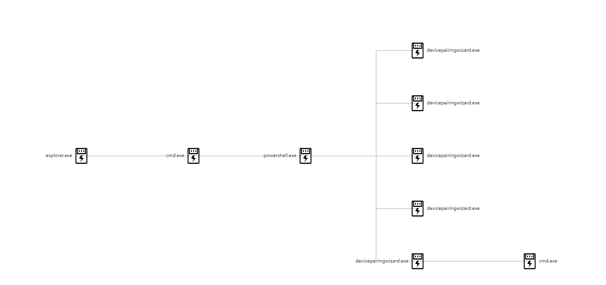
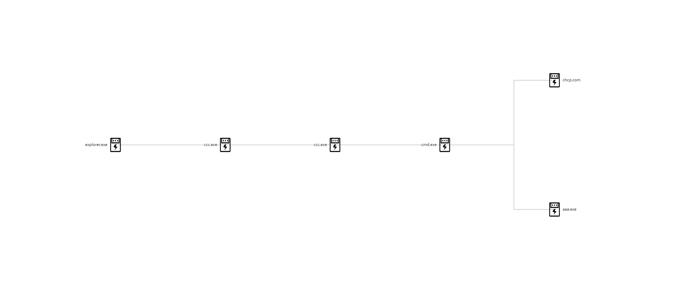
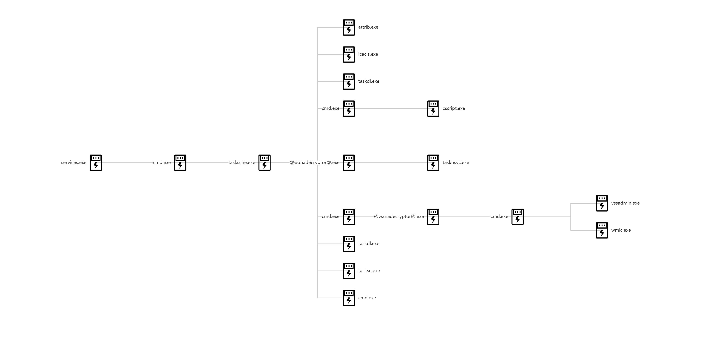
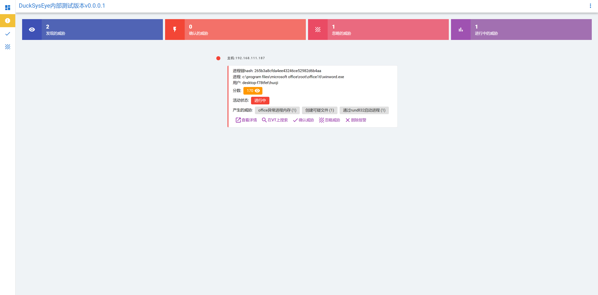

 

# RmEye
RmEye是一个window上的基于att&ck现代EDR设计思想的威胁响应工具.
不同于EDR,它轻量、高效.自身定位是轻量级威胁检出工具.
而不是繁重的、需要付费的、效果不明的所谓的EDR
RmEye基于att&ck模型,如果您对att&ck模型不熟悉,请先阅读相关文章后再使用:  
https://key08.com/index.php/2022/08/09/1505.html

### 功能特点
1. 基于att&ck设计.所有设计只是为了符合att&ck的攻击路径、攻击链(虽然规则里面没有标注T因为懒惰)
2. 轻量、高效.为了不适用繁重超占内存的ELK设计思路,而且要保证检出的同时保证不会太重,agent端使用了大量规则过滤,这样才使得后端使用sqlite作为数据库成为可能.单机日志平均一天4M.此外轻量级别的客户端一天只占40-400KB的内存.
3. 行为检出,让免杀成为过去式.基于att&ck设计,只看行为不看文件.文件类免杀已经成为过去式.
4. 高扩展性.可随需求定制功能

### RmEye 之所以不是 Edr/Xdr/Mdr/Ndr/XXXXXdr
1. RmEye没有流量监控
2. RmEye仅覆盖20%左右的datasource
3. RmEye没有联动WAF、IPS/IDS
4. RmEye没有实时拦截功能
5. 对RPC、COM、ALPC基本无能为力
6. 不支持更高级的扩展检测,如检测脚本、下发规则,主机链
7. 受限于Sysmon,很多att&ck的T没有覆盖,也无法覆盖.
请牢记,RmEye自身定位是轻量级威胁检出工具

### 最新新闻
2022/8/29:
增加uac提权检测插件`uac_bypass_detect`,但是受限于sysmon,没有办法获取RPC信息,因此只能检测一部分的UAC提权行为.并且有误报,请酌情考虑

### 检出截图
威胁列表:

powershell:

apt样本:

勒索软件:

网站入侵提权到执行cobalt strike:

offic宏钓鱼:

uac提权检测:


### 待做列表
1. 更好的前端(目前是VUE-CDN模式,不太好,想换成VUE-CLI) 已经完成
2. 日志回放【目前重点】
3. 威胁狩猎【目前重点】
4. att&ck热力图
5. 在线规则编辑器
6. 内网横向检测
7. iis、apache、nginx日志搜集分析(aka: XDR的实现)
8. 集成反病毒引擎
9. 完善目前的插件系统【目前重点】
10. 云日志检测能力【目前重点】
### 安装
下载release( https://github.com/RoomaSec/RmEye/releases ),里面有客户端,服务端自行clone本项目  
服务端是python3编写,安装完依赖库后输入
```
python webserver.py
```
即可部署  
服务端部署后,修改config.py里面的  
```
# 检出阈值,越高越难检出但是也会越准确  
MAX_THREAT_SCORE = 170

# 授权访问主站的IP列表.如果不在后台里面则不能访问后台  
ALLOW_ACCESS_IP = ['127.0.0.1']
```
MAX_THREAT_SCORE代表报警分数,意思为进程链总分超过此分数则报警,越高越准但是也会漏报
ALLOW_ACCESS_IP代表允许的IP,只有在此名单里面的IP才能访问后台.请增加自己的IP地址  

客户端则编辑config.ini  
```
[communication]
server = http://192.168.111.189:5000
```
其中server改成你的服务端的地址  
然后分发三个文件给客户端并且放在同一目录:  
config.ini、install.cmd、RmEye.exe、sysmon.xml、Sysmon64.exe  
之后管理员身份运行install.cmd安装sysmon与RmEye  
访问 http://服务器ip:5000(flask默认端口) 查看后台  
当然一开始啥数据也没有,为了确认是否安装成功可以将webserver.py中的  
```
    flask_log = logging.getLogger('werkzeug')
    flask_log.setLevel(logging.ERROR)
```
注释掉,检查有没有客户端的请求即可   
手动安装(cmd脚本其实执行了这些命令):
```
//安装sysmon:
sysmon -i 
//sysmon加载配置项
sysmon -c sysmon.xml
//安装RmEye
RmEye /install
```

### 卸载
卸载RmEye:
在RmEye目录下执行
```
SysEye /uninstall
```
如果您需要卸载sysmon
执行
```
sysmon /uninstall
```
即可干净卫生的卸载掉RmEye

### 规则相关的问题
1. 规则目前仅120条,很多攻击面没有覆盖,其他规则请访问《社区》
2. 规则目前只支持rule_engine与yara的规则,其中yara的规则支持是以插件的形式支持
3. 目前的规则字段完全依赖sysmon的字段,sysmon的字段请检查根目录下的provider.json(但是请记住纯小写,自行做大小写转换)

规则目前在`Server/rules`目录规则目前有两种规则:
rule_engine:
如检测由CMD启动的ipconfig:
```
{
    'rules': [
        'originalfilename =~ ".*cmd.exe" and commandline =~ ".*ipconfig.*"',
    ],
    'score': 80,
    'name': 'cmd启动ipconfig'
},
```
分数代表的是本次规则给进程链所增加的分数,报警是根据前面的MAX_THREAT_SCORE设置的

具体编写方法请移步:
https://github.com/zeroSteiner/rule-engine

yara,需要安装插件,具体请看交流部分

### 第三方引用库
1. sysmon
https://docs.microsoft.com/zh-cn/sysinternals/downloads/sysmon
2. rule_engine
https://github.com/zeroSteiner/rule-engine
3. yara
https://github.com/VirusTotal/yara
4. sysmon-config(客户端使用的默认的规则,但是我做了一些修改)
https://github.com/SwiftOnSecurity/sysmon-config  
请遵守相关库的开源协议.相关法律风险本项目不负任何责任

### 交流
开源的目的不是为了免费填鸭式教学,或者被免费拿去发公众号引流、去拿去集成产品方案去赚钱,而是要一起完善这个工具,从而实现共赢.
扫一扫加入这个工具内部测试群,这样就能获取实时动态


### 特别感谢
@Pwn0x01 yara插件  
@zeroSteiner 规则引擎插件  
@SwiftOnSecurity 客户端规则
