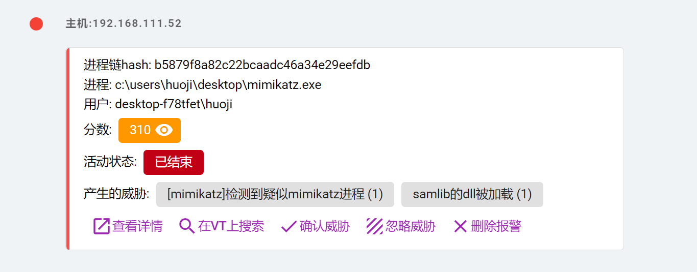

### 编写插件用于检测需要复杂上下文的威胁

在本章开始前,请先阅读:  

https://github.com/RoomaSec/RmEye/blob/main/doc_day0_rule.md

rmeye提供了一个简陋的插件接口,用于检测需要上下文帮助的威胁.本文以检测mimikatz为例,编写一个插件:  

mimikatz一定会加载如下dll:

```C
C:\Windows\System32\advapi32.dll
C:\Windows\System32\crypt32.dll
C:\Windows\System32\cryptdll.dll
C:\Windows\System32\gdi32.dll
C:\Windows\System32\imm32.dll
C:\Windows\System32\kernel32.dll
C:\Windows\System32\KernelBase.dll
C:\Windows\System32\msasn1.dll
C:\Windows\System32\msvcrt.dll
C:\Windows\System32\ntdll.dll
C:\Windows\System32\rpcrt4.dll
C:\Windows\System32\rsaenh.dll
C:\Windows\System32\samlib.dll
C:\Windows\System32\sechost.dll
C:\Windows\System32\secur32.dll
C:\Windows\System32\shell32.dll
C:\Windows\System32\shlwapi.dll
C:\Windows\System32\sspicli.dll
C:\Windows\System32\user32.dll
C:\Windows\System32\vaultcli.dll
```

当有这些的DLL在一个程序被加载的时候,我们就要注意了.但是我们之前的规则是单条的,没有上下文,因此需要通过插件系统实现,本文默认你已经给sysmon增加了以上的datasoruce

### 插件编写

在服务端`plugins`目录下新建文件夹`mimikazt_detect`然后新建一个文件`mimikatz_detect.py`,如下是模板:

```python
import global_vars
import process

rm_plugs_config = {
    "enable": True, #是否启用插件
    "author": "huoji", 
    "description": "检测mimikatz",
    "version": "0.0.1"
}

#新进程启动
def rule_new_process_create(current_process: process.Process, host, raw_log_data, json_log_data):
    return global_vars.THREAT_TYPE_NONE

#进程动作
def rule_new_process_action(current_process: process.Process, host, raw_log_data, json_log_data):
    return global_vars.THREAT_TYPE_NONE

#规则初始化
def rule_init():
    pass

#插件初始化
def plugin_init():
    print('mimikatz检测插件 2022/9/5 by huoji')

```

为了检测,我们需要记录每一个dll加载的行为并且保存到进程上下文中,具体看代码

```python
import global_vars
import process

rm_plugs_config = {
    "enable": True,
    "author": "huoji",
    "description": "检测mimikatz",
    "version": "0.0.1"
}

mimikatz_dll_list = [
    'c:\\windows\\system32\\advapi32.dll',
    'c:\\windows\\system32\\crypt32.dll',
    'c:\\windows\\system32\\cryptdll.dll',
    'c:\\windows\\system32\\gdi32.dll',
    'c:\\windows\\system32\\imm32.dll',
    'c:\\windows\\system32\\kernel32.dll',
    'c:\\windows\\system32\\kernelbase.dll',
    'c:\\windows\\system32\\msasn1.dll',
    'c:\\windows\\system32\\msvcrt.dll',
    'c:\\windows\\system32\\ntdll.dll',
    'c:\\windows\\system32\\rpcrt4.dll',
    'c:\\windows\\system32\\rsaenh.dll',
    'c:\\windows\\system32\\samlib.dll',
    'c:\\windows\\system32\\sechost.dll',
    'c:\\windows\\system32\\secur32.dll',
    'c:\\windows\\system32\\shell32.dll',
    'c:\\windows\\system32\\shlwapi.dll',
    'c:\\windows\\system32\\sspicli.dll',
    'c:\\windows\\system32\\user32.dll',
    'c:\\windows\\system32\\vaultcli.dll',
]


def rule_new_process_create(current_process: process.Process, host, raw_log_data, json_log_data):
    # 服务端提供了一个 plugin_var 变量用于存放当前进程插件的上下文
    current_process.plugin_var['mimikatz_matched_num'] = 0
    current_process.plugin_var['mimikatz_detected'] = False
    return global_vars.THREAT_TYPE_NONE


def rule_new_process_action(current_process: process.Process, host, raw_log_data, json_log_data):
    global mimikatz_dll_list
    # 如果日志的action是imageload(dll加载)
    if json_log_data['action'] == 'imageload' and current_process.plugin_var['mimikatz_detected'] == False:
        # 把日志中的dll路径取出来
        dll_path = json_log_data['data']['imageloaded']

        # 如果dll的路径在mimikatz的路径里面,进程上下文+1
        if dll_path in mimikatz_dll_list:
            current_process.plugin_var['mimikatz_matched_num'] += 1
        if current_process.plugin_var['mimikatz_matched_num'] >= len(mimikatz_dll_list):
            current_process.set_score(300, "[mimikatz]检测到疑似mimikatz进程")
            current_process.plugin_var['mimikatz_detected'] = True
            return global_vars.THREAT_TYPE_PROCESS
    return global_vars.THREAT_TYPE_NONE


def rule_init():
    pass


def plugin_init():
    print('mimikatz检测插件 2022/9/5 by huoji')

```


### 测试

运行mimikatz:


当然还会有其他的情况的误报!这需要你完善插件.   

如果遇到不懂的地方,可以提issue.欢迎提问
